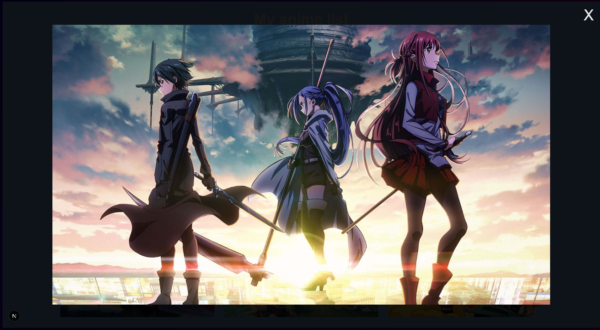

# 🖼️ React Image Gallery with Modal

Pequena aplicação desenvolvida em **React + TypeScript** que exibe uma galeria de imagens em grid, permitindo visualizar cada imagem em tamanho ampliado através de um modal reutilizável.

O projeto foi construído com foco em **componentização**, **gerenciamento de estado** e **organização de código**.

---

## 🚀 Funcionalidades

- Grid responsivo de imagens  
- Abertura de modal ao clicar em uma imagem  
- Fechamento do modal  
- Componentes reutilizáveis  
- Tipagem com TypeScript  

---

## 🛠️ Tecnologias utilizadas

- React  
- TypeScript  
- Tailwind CSS  

---

## 📚 Conceitos aplicados

- Componentização  
- useState para controle de UI  
- Tipagem com TypeScript  
- Separação de dados e apresentação  
- Props entre componentes  
- Estruturação básica de projeto React  

---

## ▶️ Como rodar o projeto

```bash
npm install
npm run dev
```

---

## 💡 Observação

Projeto criado como exercício prático para consolidar conceitos de React e TypeScript.

---

## 📸 Preview



